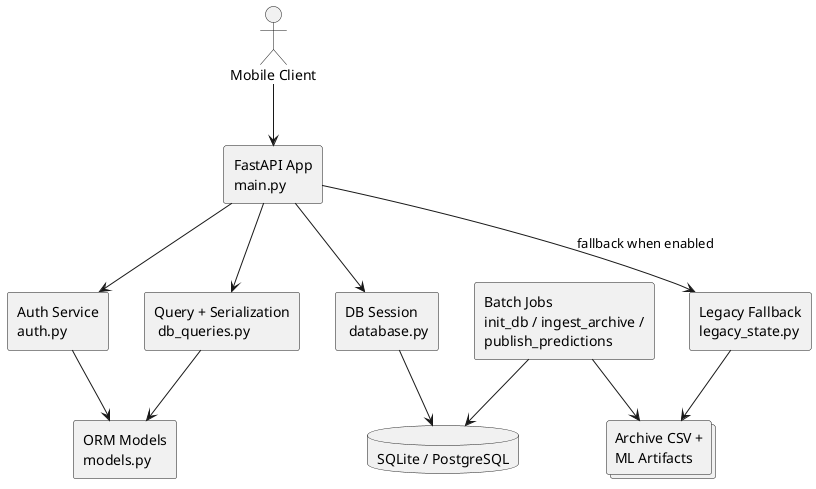
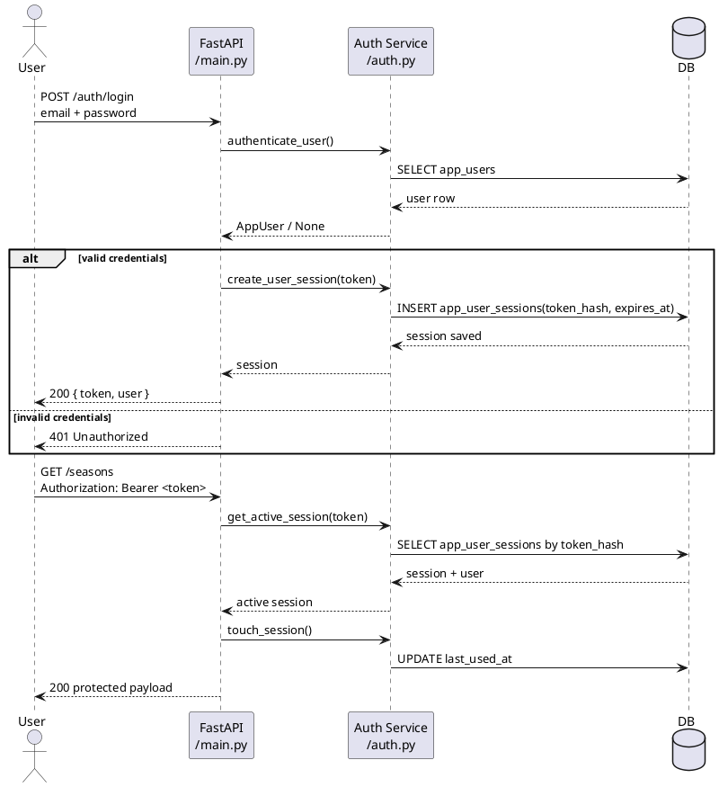
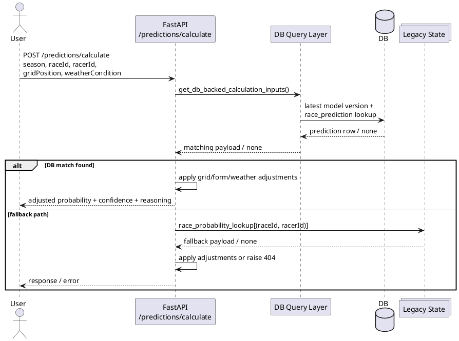
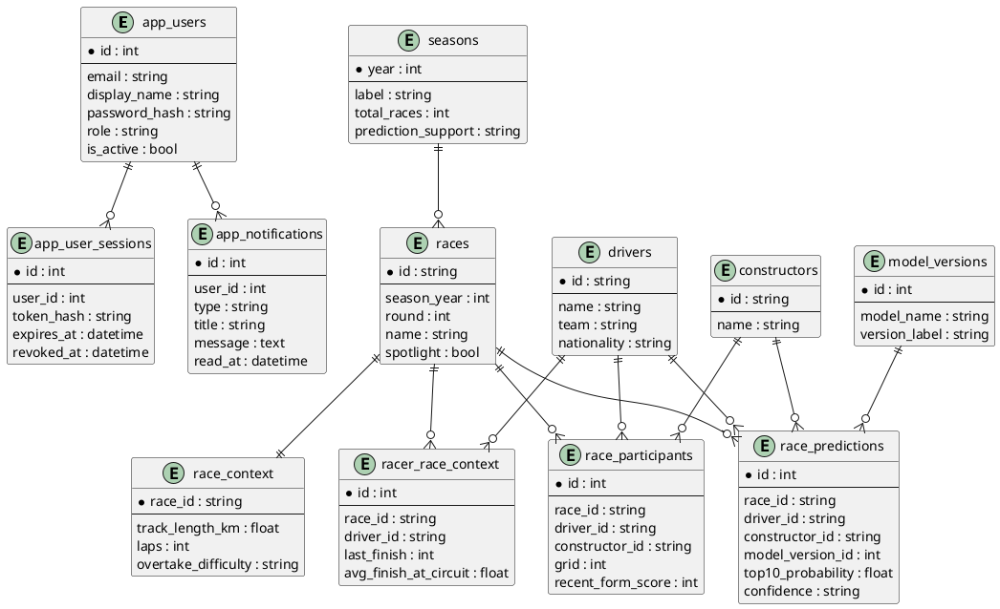

# F1 Insight Hub - Документация на Backend слоя

## 1. Резюме
Този документ описва единствено backend слоя на **F1 Insight Hub**. Фокусът е върху реалната имплементация в `backend/` и покрива FastAPI приложението, схемата на базата данни, слоя за автентикация, DB-first модела на обслужване, batch скриптовете за инициализация и публикуване на данни, както и най-важните backend потоци.

Документацията не разглежда mobile/frontend и ML notebook частите като самостоятелни deliverable-и, освен там, където те влияят директно върху backend поведението.

**Основни теми:**
- архитектура на backend приложението и отговорности на модулите;
- REST API endpoints и защита на маршрутите;
- SQLAlchemy ORM модел и релации между основните таблици;
- session-based authentication с Argon2 и bearer token поток;
- DB-first serving с legacy fallback;
- batch pipeline за `init_db.py`, `ingest_archive.py` и `publish_predictions.py`;
- PlantUML диаграми за най-важните backend зависимости и процеси.

## 2. Цел и обхват
### Цел
Да се документира backend реализацията така, че нов разработчик или проверяващ да може бързо да разбере:
- как се стартира услугата;
- какви данни обслужва;
- как се защитават ресурсите;
- как се зареждат и публикуват архивни и ML-породени данни;
- какви са основните ограничения и точките за разширяване.

### Включено в обхвата
- `backend/main.py`
- `backend/auth.py`
- `backend/database.py`
- `backend/models.py`
- `backend/schemas.py`
- `backend/db_queries.py`
- `backend/config.py`
- `backend/helpers.py`
- `backend/init_db.py`
- `backend/ingest_archive.py`
- `backend/publish_predictions.py`
- `backend/legacy_state.py`
- `backend/alembic/`
- `backend/tests/test_auth_api.py`

### Извън обхвата
- mobile UI, навигация и визуални компоненти;
- training notebook-и и детайлна ML методология;
- deployment инфраструктура извън локалната/академичната среда.

## 3. Теоретична основа
Backend-ът е реализиран с **FastAPI**, което позволява изграждане на типизиран REST API с dependency injection, Pydantic валидация и ясна декларация на маршрутите. Персистентният слой е изграден със **SQLAlchemy ORM**, а схемата се управлява с **Alembic**. Това позволява стабилен договор между приложния код и базата данни и отделя онлайн serving логиката от batch процесите.

Архитектурно проектът следва **DB-first serving** подход. Мобилното приложение не чете директно CSV/Parquet файлове и не извиква ML pipeline-а в реално време. Вместо това:
- архивните данни първо се ingest-ват в релационна база;
- model output-ите се публикуват предварително като `race_predictions`;
- online API слой само чете и сериализира готови служебни данни.

Това решение е по-подходящо за production-подобен backend, защото:
- намалява латентността на заявките;
- гарантира по-стабилни payload-и;
- позволява версия на модела чрез `model_versions`;
- отделя тежките изчисления от request/response жизнения цикъл.

## 4. Архитектура и компоненти
Backend модулите са разделени по отговорности:

| Модул | Роля |
| --- | --- |
| `main.py` | FastAPI entrypoint, middleware, dependency wiring и всички публични маршрути |
| `auth.py` | регистрация, login, logout, password reset, notifications и session lifecycle |
| `database.py` | engine, `SessionLocal`, `Base` и DB dependency |
| `models.py` | SQLAlchemy ORM моделите |
| `schemas.py` | Pydantic request/response модели |
| `db_queries.py` | select заявки и сериализация към API payload-и |
| `config.py` | runtime конфигурация и serving флагове |
| `helpers.py` | домейн помощни функции и label-и |
| `legacy_state.py` | fallback зареждане на данни от файлове в паметта |
| `init_db.py` | инициализация/upgrade на схемата чрез Alembic |
| `ingest_archive.py` | ingest на архивни CSV данни към serving schema |
| `publish_predictions.py` | публикуване на model output към serving таблиците |

### Архитектурна идея
Онлайн заявките минават през `main.py`, който използва dependency injection за база данни и текущ потребител. Достъпът до данните по подразбиране е от базата, а `legacy_state.py` остава като изолиран fallback слой, активиран чрез конфигурация.

```python
app = FastAPI(
    title="F1 Insight Hub Backend",
    description="FastAPI backend serving F1 archive data and Top-10 model inference for the mobile app.",
    version="2.0.0",
    lifespan=lifespan,
)

@app.get("/seasons")
def get_seasons(_current_user: AppUser = Depends(get_current_user), db: Session = Depends(get_db_session)):
    state.require_ready()
    seasons = db.execute(select_from_seasons()).scalars().all()
    if seasons:
        return [
            {
                "year": season.year,
                "label": season.label,
                "totalRaces": season.total_races,
                "championHint": season.champion_hint,
                "predictionSupport": season.prediction_support,
                "supportMessage": season.support_message,
            }
            for season in seasons
        ]
    return state.seasons
```

### PlantUML диаграма: основни backend компоненти


## 5. API слой и бизнес логика
### 5.1 Публични и защитени маршрути
Почти всички приложни данни са защитени с bearer token. Непосредствено публични са:
- `GET /` за health/status;
- `POST /auth/register`;
- `POST /auth/login`.

Всички останали основни data endpoints използват `Depends(get_current_user)`:
- `GET /auth/me`
- `POST /auth/logout`
- `GET /auth/notifications`
- `POST /auth/notifications/read-all`
- `POST /auth/password/reset`
- `GET /seasons`
- `GET /seasons/{year}/races`
- `GET /races`
- `GET /races/featured`
- `GET /races/{race_id}`
- `GET /races/{race_id}/predictions/top10`
- `GET /races/{race_id}/participants`
- `GET /races/{race_id}/racers/{racer_id}`
- `GET /racers`
- `POST /predictions/calculate`

### 5.2 Защита на маршрутите
`main.py` извлича bearer token-а от `Authorization` header, търси активна сесия и обновява `last_used_at`.

```python
def get_current_user(
    authorization: str | None = Header(default=None),
    db: Session = Depends(get_db_session),
) -> AppUser:
    token = extract_bearer_token(authorization)
    session = get_active_session(db, token)
    if session is None:
        raise HTTPException(status_code=status.HTTP_401_UNAUTHORIZED, detail="Session expired or invalid.")
    touch_session(db, session)
    return session.user
```

Това решение е session-based, а не JWT-based. Реалният token не се пази директно в базата, а само неговият SHA-256 hash.

### 5.3 Примерен login поток
```python
@app.post("/auth/login", response_model=AuthResponsePayload)
def login_user(payload: LoginPayload, db: Session = Depends(get_db_session)) -> dict[str, Any]:
    user = authenticate_user(db, email=payload.email, password=payload.password)
    if user is None:
        raise HTTPException(status_code=status.HTTP_401_UNAUTHORIZED, detail="Invalid email or password.")

    token = token_urlsafe(32)
    create_user_session(db, user, token)
    return {
        "token": token,
        "user": serialize_auth_user(user),
    }
```

### PlantUML диаграма: login и достъп до защитен endpoint


### 5.4 Основни data endpoints
Data маршрутите са тънки и прехвърлят по-голямата част от data shaping логиката към `db_queries.py`. Примерът за Top-10 predictions е типичен:

```python
@app.get("/races/{race_id}/predictions/top10")
def get_top10_prediction(
    race_id: str,
    _current_user: AppUser = Depends(get_current_user),
    db: Session = Depends(get_db_session),
) -> list[dict[str, Any]]:
    state.require_ready()
    state.require_model()
    model_version_id = latest_model_version_id(db)
    if model_version_id is not None:
        rows = db.execute(select_top10_predictions(race_id, model_version_id)).all()
        if rows:
            return serialize_top10_rows(rows)

    predictions = state.race_predictions.get(race_id)
    if predictions is None:
        raise HTTPException(status_code=404, detail=f"No prediction rows found for race {race_id}")
    return predictions
```

Тук се виждат три важни решения:
- backend-ът очаква precomputed predictions;
- взема последната налична версия на модела;
- има fallback към in-memory state само при липса на DB резултат и активиран legacy режим.

### 5.5 Prediction calculator логика
`POST /predictions/calculate` не тренира или извиква модела онлайн. Той използва вече публикуваната базова вероятност и добавя леки сценарни корекции за grid позиция, recent form и weather.

```python
probability = float(matching["top10Probability"])
grid_adjustment = max(min((11 - payload.gridPosition) * 0.012, 0.12), -0.12)
recent_form_score = int(matching.get("recentFormScore", 50))
form_adjustment = max(min((recent_form_score - 50) / 400, 0.12), -0.12)
weather_adjustment = {"Dry": 0.01, "Mixed": -0.01, "Wet": -0.025}.get(payload.weatherCondition, 0.0)
adjusted_probability = max(0.01, min(0.99, probability + grid_adjustment + form_adjustment + weather_adjustment))
```

Това означава, че калкулаторът е **hybrid serving flow**:
- базовата стойност е реален precomputed model output;
- потребителят може да симулира сценарий;
- backend-ът не изисква ръчно въвеждане на сложни ML features.

### PlantUML диаграма: prediction calculator поток


## 6. Модел на данните
Backend схемата разделя serving данните от суровите архивни и ML артефакти. Основните таблици са:
- `seasons`
- `races`
- `constructors`
- `drivers`
- `race_context`
- `model_versions`
- `race_participants`
- `race_predictions`
- `racer_race_context`
- `app_users`
- `app_user_sessions`
- `app_notifications`

### 6.1 Примерен ORM модел
```python
class RacePrediction(Base):
    __tablename__ = "race_predictions"
    __table_args__ = (
        UniqueConstraint("race_id", "driver_id", "model_version_id", name="uq_race_predictions_race_driver_model"),
    )

    id: Mapped[int] = mapped_column(Integer, primary_key=True, autoincrement=True)
    race_id: Mapped[str] = mapped_column(ForeignKey("races.id"), nullable=False, index=True)
    driver_id: Mapped[str] = mapped_column(ForeignKey("drivers.id"), nullable=False, index=True)
    constructor_id: Mapped[str | None] = mapped_column(ForeignKey("constructors.id"), nullable=True)
    model_version_id: Mapped[int] = mapped_column(ForeignKey("model_versions.id"), nullable=False, index=True)
    top10_probability: Mapped[float] = mapped_column(Float, nullable=False)
    confidence: Mapped[str] = mapped_column(String(16), nullable=False, default=ConfidenceLevel.MEDIUM.value)
```

### 6.2 Логически групи
**Потребители и сигурност**
- `app_users`
- `app_user_sessions`
- `app_notifications`

**Справочни домейн данни**
- `seasons`
- `races`
- `constructors`
- `drivers`

**Race-specific serving данни**
- `race_context`
- `race_participants`
- `racer_race_context`

**ML serving данни**
- `model_versions`
- `race_predictions`

### PlantUML диаграма: основни релации


## 7. Автентикация и валидация
### 7.1 Регистрация и login
Регистрацията и login-ът използват Pydantic модели за валидация и `argon2-cffi` за хеширане на пароли.

```python
password_hasher = PasswordHasher(
    time_cost=3,
    memory_cost=65536,
    parallelism=2,
    hash_len=32,
    salt_len=16,
)
```

Email стойностите се нормализират до lowercase и се валидират с regex в `schemas.py`.

```python
class RegisterPayload(BaseModel):
    email: str
    password: str = Field(min_length=8, max_length=128)
    displayName: str | None = Field(default=None, max_length=80)

    @field_validator("email")
    @classmethod
    def validate_email(cls, value: str) -> str:
        normalized = value.strip().lower()
        if not EMAIL_PATTERN.match(normalized):
            raise ValueError("Enter a valid email address.")
        return normalized
```

### 7.2 Session lifecycle
Сесиите имат TTL от 30 дни:

```python
SESSION_TTL_DAYS = 30
```

При logout сесията не се изтрива физически, а се маркира с `revoked_at`. Това е удачно, защото:
- пази audit-like история;
- улеснява проверката дали token е невалиден;
- не изисква специална blacklist структура.

### 7.3 Нотификации
Промяната на парола автоматично създава запис в `app_notifications`, което е пример за проста домейн реакция вътре в auth слоя.

## 8. Работа с данни и serving режим
Конфигурацията в `config.py` определя дали приложението ще работи в DB-first режим или с legacy fallback:

```python
F1_SERVING_MODE = os.getenv("F1_SERVING_MODE", "db").strip().lower()
LEGACY_FALLBACK_ENABLED = os.getenv("F1_ENABLE_LEGACY_FALLBACK", "false").strip().lower() == "true"
DB_SERVING_ENABLED = F1_SERVING_MODE != "legacy"
```

### 8.1 DB-first режим
Нормалният режим е:
- `F1_SERVING_MODE=db`
- `F1_ENABLE_LEGACY_FALLBACK=false`

В този режим:
- API чете от релационната база;
- `legacy_state.py` се използва само като резервен механизъм при специфични случаи;
- online serving не зависи от директно четене на CSV/Parquet в request време.

### 8.2 Legacy fallback
`BackendState.load()` зарежда model metadata и при нужда чете архивните файлове в паметта. Това е полезно за:
- локална разработка без пълна база;
- преход от прототип към по-структуриран backend;
- резервен режим при академична демонстрация.

## 9. Инициализация, ingest и publish pipeline
Backend-ът включва три важни служебни скрипта.

### 9.1 `init_db.py`
Скриптът използва Alembic и:
- създава схемата, ако базата е празна;
- stamp-ва съществуваща схема, ако няма `alembic_version`;
- upgrade-ва до `head`, ако базата вече е versioned.

```python
if not table_names:
    command.upgrade(config, "head")
    print(f"Initialized database schema at {DATABASE_URL} via Alembic upgrade head")
    return
```

### 9.2 `ingest_archive.py`
Този скрипт:
- чете архивните CSV файлове;
- конструира `Season`, `Race`, `Constructor`, `Driver` и `RaceContext` записи;
- добавя support metadata според training window-а на модела;
- записва serving таблиците.

### 9.3 `publish_predictions.py`
Този скрипт:
- зарежда `feature_df.parquet`, metadata и pipeline;
- изчислява `top10_probability`;
- създава/обновява `ModelVersion`;
- публикува `RaceParticipant`, `RacePrediction` и `RacerRaceContextRecord`.

Това е ключовото място, което свързва ML артефактите със serving базата.

## 10. Конфигурация и стартиране
### 10.1 Зависимости
`backend/requirements.txt` съдържа основните runtime библиотеки:

```txt
argon2-cffi
fastapi
uvicorn[standard]
pandas
pyarrow
joblib
scikit-learn
xgboost
sqlalchemy
alembic
psycopg[binary]
```

### 10.2 База данни
По подразбиране `database.py` използва SQLite файл в `backend/f1_insight_hub.db`, но може да се подаде и външен `DATABASE_URL`.

```python
def get_database_url() -> str:
    return os.getenv("DATABASE_URL", f"sqlite:///{DEFAULT_SQLITE_PATH}")
```

### 10.3 Типична последователност
```bash
cd backend
pip install -r requirements.txt
python init_db.py
python ingest_archive.py
python publish_predictions.py
uvicorn main:app --reload
```

### 10.4 Health check
Началният endpoint връща служебна информация за състоянието на приложението:

```json
{
  "status": "ok",
  "archiveReady": true,
  "modelReady": true,
  "servingMode": "db",
  "legacyFallbackEnabled": false
}
```

## 11. Тестване
Наличният автоматизиран тестов файл е `backend/tests/test_auth_api.py`. Той покрива:
- registration/login round-trip;
- duplicate email защита;
- invalid password при login;
- проверка, че паролата се пази като Argon2 hash;
- отказ на защитен маршрут без token;
- password reset и създаване на notification.

Примерен тест:

```python
def test_protected_data_route_requires_authentication(self) -> None:
    response = self.client.get("/seasons")
    self.assertEqual(response.status_code, 401)
```

Тестовете използват временна SQLite база, което ги прави подходящи за бърз smoke/integration слой без външен PostgreSQL dependency.

## 12. Ограничения и препоръки
### Ограничения
- `allow_origins=["*"]` е удобно за разработка, но не е production-safe конфигурация.
- Session token-ите са stateful и изискват DB lookup при всяка защитена заявка.
- `predictions/calculate` използва heuristic adjustments, а не online inference.
- Част от fallback логиката все още поддържа исторически преходен слой, което увеличава сложността.
- Няма отделен service layer между route handlers и query/auth функциите.

### Препоръки
- да се въведе по-строга CORS политика;
- да се добавят integration тестове и за data endpoints;
- да се отделят auth/data/prediction router-и по модули;
- да се разшири observability слой с structured logging;
- да се документират официално environment variables в отделен operational guide.

## 13. Заключение
Backend-ът на F1 Insight Hub вече не е прототип, а работещ data-serving слой с ясна релационна схема, автентикация, batch ingestion/publish pipeline и защитени REST endpoints. Най-важното архитектурно решение е отделянето на online API serving от ML training и суровите архивни файлове. Това прави системата по-лесна за поддръжка, по-предвидима за mobile клиента и по-близка до реален production backend модел.
