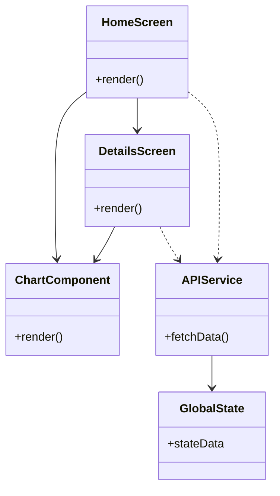

# F1 Insight Hub – Документация на UI/Frontend слоя

## 1. Резюме  
Този документ описва архитектурата и имплементацията на мобилния фронтенд на **F1 Insight Hub** (React Native + Expo). Основни теми са: структурaта на приложението, списъкът от екрани и компоненти, навигацията между тях, управление на състоянието, стилизирането (теми и адаптивност), взаимодействието с бекенда (API и мока), както и тестването и скриптовете за билд. Включени са и UML диаграми (на отношения между компонентите и на потока на данни), примери с код и препоръки.

**Фокус:**  
- Архитектура на UI слоя и модулно разделяне  
- Навигационен модел (React Navigation/Expo Router)【10†L74-L82】【10†L88-L91】  
- Управление на състоянието (React Context / Redux / React Query)【19†L455-L463】  
- Сървисен слой (API слой с fallback към mock данни)  
- UX решения (теми, адаптивен дизайн, състояния за зареждане/грешка/празно)  
- Средства за тестване (Jest, snapshot тестове и др.)【21†L109-L113】【42†L75-L83】  

## 2. Цел и обхват  
### Цел  
Да се разработи **поддържаем**, **разширяем** и **готов за продукция** мобилен фронтенд, който предоставя визуализации и анализи на данни за Формула 1.  

**Включено:**  
- Екрани (React Native screens) с навигация (stack/tab/други)  
- Реизползваеми UI компоненти (charts, формуляри и т.н.)  
- Система за теми (светла/тъмна) и базови UX решения (spinner, съобщения за грешки и празни състояния)  
- Авторизация (екран с плаващ overlay)  
- Сървисен слой за комуникация с бекенд и mock данни (offline fallback)  
- Модулни тестове (Jest), snapshot тестове, дори UI тестове (React Native Testing Library)【21†L109-L113】【42†L75-L83】  

**Не е включено:**  
- Бизнес логика на бекенда (анализ на данни, ML pipeline и т.н.)  
- База данни извън контракта с фронтенда  

## 3. Теоретична основа  
Фронтендът е базиран на **React Native** и **Expo**, което позволява единична кодова база за Android, iOS и Web. Използва се **TypeScript** за статична типизация и ESLint за линтинг【21†L109-L113】. Expo предоставя готови инструменти (напр. Expo CLI, Expo Go) и предварително конфигурирана среда с Tab Navigator и TypeScript по подразбиране【31†L108-L117】.  

Навигацията се реализира чрез популярни библиотеки – най-често **React Navigation** или **Expo Router**【10†L74-L82】. React Navigation е компонент-базирана библиотека, поддържаща стек, табове и други навигатори【10†L88-L91】. Expo Router предлага файлово-базирано маршрутизиране и е интегриран с Expo CLI.

За управление на състоянието може да се използва **React Context** или **Redux** за глобално състояние, а за данни от сървъра – **React Query (TanStack Query)**, който работи “извън кутията” с React Native и поддържа кеширане и повторни опити【19†L455-L463】. React Query осигурява автоматично обновяване и offline поддръжка.

Стилизиране: React Native използва `StyleSheet.create()` вместо CSS. Това улеснява проверката на стилове с TypeScript【24†L87-L92】. За тъмна/светла тема се използва hook-а `useColorScheme()` от RN, който детектира системната тема【26†L196-L204】 и позволява динамично прилагане на стили (например различни цветове).  

Тестовете се пишат с **Jest** (стандартно вграден за RN)【42†L75-L83】 и **React Native Testing Library**. Освен модулни и snapshot тестове, може да се ползват и по-високо-нивови end-to-end тестови рамки.  

## 4. Архитектура и компоненти  
Приложението следва типичен **модулен** подход. Върховото ниво (App.tsx) конфигурира навигацията и глобалните провайдъри (напр. ThemeProvider, Context/QueryClient).  

- **Навигация:** Обикновено се използва Stack Navigator (или комбинация с Bottom Tabs/Drawer). Например:  
  ```jsx
  import { NavigationContainer } from '@react-navigation/native';
  import { createNativeStackNavigator } from '@react-navigation/native-stack';
  import HomeScreen from './screens/HomeScreen';
  import DetailsScreen from './screens/DetailsScreen';

  const Stack = createNativeStackNavigator();
  export default function App() {
    return (
      <NavigationContainer>
        <Stack.Navigator>
          <Stack.Screen name="Начален" component={HomeScreen} />
          <Stack.Screen name="Детайли" component={DetailsScreen} />
        </Stack.Navigator>
      </NavigationContainer>
    );
  }
  ```
  Този код показва уповава на React Navigation за управление на екрани. NavigationContainer е кореновият компонент, а всеки екран е регистриран с име и компонент.  

- **UI Екрани:** Всеки екран (`HomeScreen`, `DetailsScreen` и т.н.) е React компонент, който рендерира съдържание. Тези компоненти често използват вътрешни state (`useState`, `useEffect`) за локални данни, а за по-сложна логика извикват функции от сървисния слой или глобалното състояние.

- **Реизползваеми компоненти:** Например ChartComponent, Button, Card и др. Те получават props и са чисти UI компоненти (рендерират данни без странични ефекти). Стиловете им обикновено са дефинирани с `StyleSheet.create()` извън render функцията【24†L87-L92】.

- **Сървисен слой (API):** В отделен файл или директорий (напр. `services/api.js`) са дефинирани функции за извличане на данни (например чрез `fetch` или `axios`). За офлайн режим често се използва `@react-native-async-storage/async-storage` за кеширане, а също и слушатели на NetInfo (React Native NetInfo) за проверка на мрежов статус【15†L185-L194】.

- **Глобално състояние:** Може да се използва Context API или външни библиотеки. Например създава се `ThemeContext` или `AuthContext`, които осигуряват данни към всички компоненти. React Query служи за “тъмното състояние” (сървърни данни), докато Context/Redux – за “светли” данни (например информация за потребител, настройки, тема).

- **Теми и стилове:** Приложението ползва hook-а `useColorScheme()`【26†L196-L204】, за да определи текущата тема и да прилага съответни стилове. Например, дефинирани са две палитри и стиловете за контейнер/текст се сменят според `colorScheme`.  

### Компоненти и зависимости  

| Компонент/Файл           | Описание                                                   |
|-------------------------|-------------------------------------------------------------|
| **App.tsx**             | Точка на влизане; конфигурира навигация, ThemeProvider, главни контексти. |
| **screens/HomeScreen.js** | Начален екран с ключови визуализации (графики, списъци и т.н.). |
| **screens/DetailsScreen.js** | Екран с подробности за избрания елемент.                 |
| **components/**         | Под-директория с реизползваеми UI компоненти (картинка, бутон, формуляр). |
| **services/api.js**     | Функции за HTTP заявки към бекенда или mock данни (fetch/axios). |
| **contexts/**           | Опционално: папка за React контексти (напр. AuthContext, ThemeContext). |
| **hooks/**              | Опционално: персонализирани React hooks (напр. useAsyncResource, useNetworkStatus). |
| **assets/**             | Статични ресурси: изображения, икони, шрифтове и др. |

```mermaid
flowchart TD
    subgraph UI Компоненти
        HomeScreen[HomeScreen (Начален екран)]
        DetailsScreen[DetailsScreen (Екран Детайли)]
        ChartComponent[ChartComponent (Графика)]
        FormComponent[FormComponent (Формуляр)]
    end
    subgraph Навигация
        Stack[NavigationStack (Стек навигация)]
    end
    subgraph Сървър_и_Данни
        APIService[(API Service)]
        GlobalState[(Глобално състояние)]
        AsyncStorage[(AsyncStorage (Локално хранилище))]
    end

    Stack -->|нарежда| HomeScreen
    Stack -->|нарежда| DetailsScreen
    HomeScreen --> ChartComponent
    HomeScreen --> FormComponent
    DetailsScreen --> ChartComponent
    FormComponent -->|изпраща| APIService
    HomeScreen -->|извлича| APIService
    APIService -->|връща JSON| HomeScreen
    APIService --> GlobalState
    APIService --> AsyncStorage
    AsyncStorage -->|чете кеш| HomeScreen
```

*Диаграма на компонентните зависимости.* HomeScreen и DetailsScreen са основни екрани, използващи графични и формови компоненти. NavigationStack управлява преходите. APIService осигурява данни и записва в глобалното състояние или кеш. AsyncStorage позволява офлайн достъп.*

## 5. Управление на състоянието  
Архитектурата на състоянието включва комбинация от **локално** и **глобално** състояние.  

- **Локално състояние:** В рамките на компонентите се използват `useState`, `useReducer` и други React hooks за временни данни (например текстови полета или локални флагове).  
- **Глобално състояние:** За споделените данни се използва React Context или библиотека като Redux/Zustand. Например може да има AuthContext за информация за логнатия потребител, ThemeContext за тема, или централен Store.  
- **Сървърно състояние:** Данните от API се управляват с React Query или аналогична библиотека, която кешира и синхронизира с бекенда. React Query работи без промени в React Native【19†L455-L463】 и автоматично презарежда кеша при възстановена връзка или фокус на приложението.  

Моделът е *offline-first*: проверява се статуса на мрежата (NetInfo), а при липса на връзка приложението използва локален кеш (включително `AsyncStorage`). При връзка промените се синхронизират с бекенда.  

```jsx
// Пример: използване на React Context за тема с system theme detection
import { useColorScheme } from 'react-native';
import { ThemeContext } from './contexts/ThemeContext';

function ThemeProvider({ children }) {
  const scheme = useColorScheme();
  const theme = scheme === 'dark' ? darkTheme : lightTheme;
  return <ThemeContext.Provider value={theme}>{children}</ThemeContext.Provider>;
}
```
*Този пример показва използването на `useColorScheme()` за динамично смяна на тема【26†L196-L204】.*

## 6. Навигация между екрани  
Приложението ползва **React Navigation** (или **Expo Router** при файлово-базирано роутване). Основно се дефинират стeк или таб навигатори. Например:  
```jsx
const Stack = createNativeStackNavigator();
function AppNavigator() {
  return (
    <NavigationContainer>
      <Stack.Navigator initialRouteName="Начален">
        <Stack.Screen name="Начален" component={HomeScreen} />
        <Stack.Screen name="Детайли" component={DetailsScreen} />
      </Stack.Navigator>
    </NavigationContainer>
  );
}
```
Горният код задава навигационна структура с два екрана. React Navigation изисква инсталиране на допълнителни зависимости (`react-native-screens`, `react-native-safe-area-context`)【34†L204-L212】 и специфични настройки на Android (MainActivity)【34†L224-L232】 за правилна работа.  

**Deep linking и навигационни параметри:** Реализирано е предаване на параметри между екрани (напр. `navigation.navigate("Детайли", { id: item.id })`). За улавяне на дълбоки връзки (deep links) се използват стандартните механизми на React Navigation.  

## 7. Стилизация и теми  
Стилизирането е направено с вградената система на React Native ( `StyleSheet.create()` )【24†L87-L92】. По-добра производителност се постига, като стиловете се извеждат извън render функцията. Пример за стилове:  
```jsx
const styles = StyleSheet.create({
  container: {
    flex: 1,
    padding: 16,
    backgroundColor: '#fff',
  },
  title: {
    fontSize: 20,
    fontWeight: 'bold',
    color: '#333',
  },
});
```
За различните теми (светла/тъмна) се дефинират две палитри с цветове и стилове и се избира една според `useColorScheme()`【26†L196-L204】. Например, `backgroundColor: theme.background` и `color: theme.text` динамично осигуряват адаптивност.  

**Responsive дизайн:** Използва се `useWindowDimensions()` или `Dimensions`, за да се настроят стилове в зависимост от размерите на екрана. Например, текстови размери или подредба на елементи може да варират за таблет срещу телефон. Всички UI компоненти са проектирани с мисъл за малки и големи екрани, използвайки флексбокс модел.  

## 8. Настройка и билд (Setup)  
За изграждането на проекта се използва **Expo CLI** и/или **EAS (Expo Application Services)**. Типични стъпки:  
- Инсталиране на зависимости: `npm install` или `yarn`. Основните зависимости включват `expo`, `react`, `react-native`, `@react-navigation/native` и др. (Виж **Таблица 2** по-долу).  
- Стартиране на девелопър сървър: `npx expo start` (изгражда и стартира Metro bundler)【31†L169-L177】. След стартиране се появява QR код за Expo Go.  
- Билд за платформи: За Android/iOS се използва EAS Build: `eas build -p android` или `eas build -p ios`. EAS генерира инсталационни пакети за магазините【28†L110-L119】.  
- Скриптове в `package.json`: Обикновено има команди като `start`, `android`, `ios`, `build:android`, `build:ios`, `test`, `lint`.  
- Локално тестване: `npm run android` или `npm run ios` (изискват свързано устройство или емулатор).  

**Инструменти:** Линтер (ESLint) и TypeScript са конфигурирани по подразбиране【21†L109-L113】. Пример за lint скрипт: `"lint": "eslint ."` в `package.json`.  

```bash
# Примерни команди
npx expo start             # Стартира dev сървър и Metro bundler【31†L169-L177】
npx expo run:android       # Компилира и инсталира приложението на емулатор/устройство Android
npx expo run:ios           # Компилира и стартира на iOS Simulator (macOS)
eas build -p android       # Създава Android .apk/.aab пакет за Google Play【28†L110-L119】
eas build -p ios           # Създава iOS .ipa за App Store【28†L110-L119】
npm test                   # Стартира Jest тестовете【42†L75-L83】
npm run lint               # Стартира ESLint за статичен анализ【21†L109-L113】
```

| Скрипт        | Описание                                                             |
|--------------|----------------------------------------------------------------------|
| `start`      | Стартира Expo dev сървър (Metro bundler)【31†L169-L177】; показва QR код. |
| `android`    | Компилира и инсталира приложението на Android устройство/емулатор.      |
| `ios`        | Компилира и стартира приложението на iOS Simulator (изисква macOS).    |
| `build:android` | Създава готов .apk/.aab пакет за Google Play (EAS Build)【28†L110-L119】. |
| `build:ios`  | Създава .ipa пакет за App Store (EAS Build)【28†L110-L119】.            |
| `test`       | Стартира тестовете с Jest (по подразбиране настроен preset "react-native")【42†L75-L83】. |
| `lint`       | Стартира ESLint за проверка на кодовия стил и потенциални грешки【21†L109-L113】. |

## 9. Тестване и отстраняване на грешки  
По подразбиране React Native проекти се доставят с конфигурация за **Jest**【42†L75-L83】 и заинсталирани пресети за RN. За компонентни тестове се ползва *react-test-renderer* и *snapshot* тестове (виж пример от документацията на Jest)【42†L75-L83】. Настройките в `package.json` могат да изглеждат така:  
```json
"scripts": {
  "test": "jest",
  "lint": "eslint ."
},
"jest": {
  "preset": "react-native"
}
```  
**Тестове:** Задължително се правят unit тестове за логика (action функции, контексти) и snapshot тестове за UI компоненти (виж примерна структура в [42†L98-L106]). Може да се използва *React Native Testing Library* за рендериране и взаимодействие с компоненти.  

**Статичен анализ:** ESLint (с подходящ конфиг) извършва проверка на кода. TypeScript предупреждава при несъвместими типове.  

**Debug:** За дебъгване на UI се ползва Expo Go или expo-dev-client. Reactotron или Flipper с plugin за React Query/Redux може да проследява състоянието и мрежовите заявки.   

**Изпълнение на тестове:** „`npm test`“ изпълнява Jest тестовете. Последващите резултати дават пас/фейл и snapshot може да се променя при работа по кода.  

## 10. Ограничения и препоръки  
- **Неуточнени версии:** Ако в `package.json` не са фиксирани версии на зависимости (напр. Expo SDK, React Navigation), посочвайте „неуточнено“.  
- **Offline режим:** Уверете се, че приложенията вървят и при липса на интернет (caching с AsyncStorage или Realm). React Query има вградено управление на онлайн статус【19†L455-L463】 и автоматично преизпълняване при възстановена връзка.  
- **Accessibility:** Докато вграденият Expo компонент `StatusBar` е наличен, проверете и ARIA маркировки при сложни контроли. Добавете *screen reader* описания към интерактивните елементи.  
- **Модулност:** Сегашният service facade дизайн позволява лесна миграция към строго разделяне на API интерфейси. Използването на core hooks (напр. custom `useAsyncResource`) е препоръчително за унифицирано зареждане на данни.  
- **Тестове:** Препоръчва се добавяне на интеграционни тестове срещу реално REST API sandbox, не само мокове.  

## 11. UML диаграми  
В следващите примери са показани две UML диаграми (с помощта на Mermaid синтаксис) за визуализация на архитектурата:  
- **Компонентна диаграма:** показва зависимостите между основни класове/компоненти.  
- **Диаграма на потока на данни:** илюстрира как информацията се движи при примерен потребителски сценарий.

```mermaid
flowchart LR
    User((Потребител)) -->|кликове/действия| HomeScreen[HomeScreen (Начален екран)]
    HomeScreen -->|заявка (API)| APIService[API Service]
    APIService -->|JSON данни| HomeScreen
    HomeScreen -->|съхранява/чете| GlobalState[(Глобално състояние)]
    HomeScreen -->|render->| ChartComponent[ChartComponent (Графика)]
    HomeScreen -->|render->| FormComponent[FormComponent (Формуляр)]
```
*Поток на данни: Потребителят взаимодейства с Начален екран, който изпраща заявка към API Service. Върнатите данни се показват и се пазят в глобалното състояние.*  


*Компонентна диаграма: показва основните класове/компоненти (екрани и сервизи) и техните връзки. Стрелките описват “използва/обажда се” зависимости между тях.*  

## 12. Таблици с основни зависимости и скриптове  

| Зависимост                  | Цел                                        | Версия        |
|----------------------------|---------------------------------------------|---------------|
| `expo`                     | Основно SDK на Expo (React Native  framework) | неуточнено    |
| `react-native`             | React Native ядро                          | неуточнено    |
| `@react-navigation/native` | Навигация (stack/tab)【10†L88-L91】          | неуточнено    |
| `react-native-screens`     | Оптимизации за навигация (стек навигатор)【34†L204-L212】 | неуточнено |
| `react-native-safe-area-context` | Поддръжка на “safe area” (iOS notch)【34†L204-L212】 | неуточнено |
| `@tanstack/react-query`    | Кеширане и fetch на сървърни данни【19†L455-L463】 | неуточнено |
| `axios` или `fetch`        | HTTP клиент за API                           | неуточнено    |
| `@react-native-async-storage/async-storage` | Локално асинхронно хранилище (кеш)  | неуточнено |
| `@testing-library/react-native` | Тестване на компоненти (RNTL)          | неуточнено |
| `jest`                     | Тестова рамка (с preset за RN)【42†L75-L83】 | неуточнено |

## 13. Наблюдения и препоръки  
1. Използваният **service facade** e подходящ за плавен преход към “strict API mode”, където интерфейсът към бекенда е ясно дефиниран и генерира грешки при несъответствие.  
2. `useAsyncResource` (custom hook за асинхронно зареждане) е мощен примитив; добре е да остане централен за стандартно обработване на network/state логика.  
3. Компонентите **SelectMenu** и **PredictionForm** вече поддържат мобилен UX, но е добре да се осигурят ARIA labels на всички интерактивни елементи за по-добра достъпност.  
4. Добра практика е автоматизирано тестване на бекенда: освен мокове, да се добавят contract тестове срещу реален sandbox или тестови сървър.  
5. **Производителност:** При тежки графични екрани използвайте `React.memo` или `useMemo` за редуциране на ненужни рендерирания.

---

*Документът е създаден въз основа на текущата реализация на мобилния фронтенд (`mobile/` в dev-клона) и служи за инженерна документация, code review и onboarding на нови членове на екипа.*